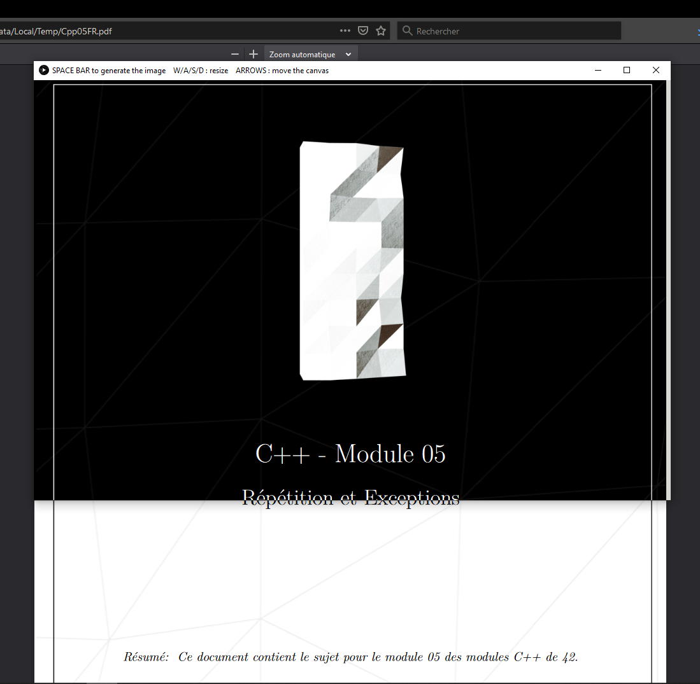

# stream\_negative
Utility that record your screen and apply a negative filter on it.

## Disclaimer
:stonks calm: This utility has been made in an hour using Processing :stonks panic:\
The goal was to read pdf witout loosing my eyes at 4AM.

## How to use it
`SPACE BAR` to generate a new image (else a kaleidoscope effect would occure)\
`W/A/S/D` or `Z/Q/S/D` to resize the canvas\
`ARROW KEYS` to move the window on top of the content you whant to capture
